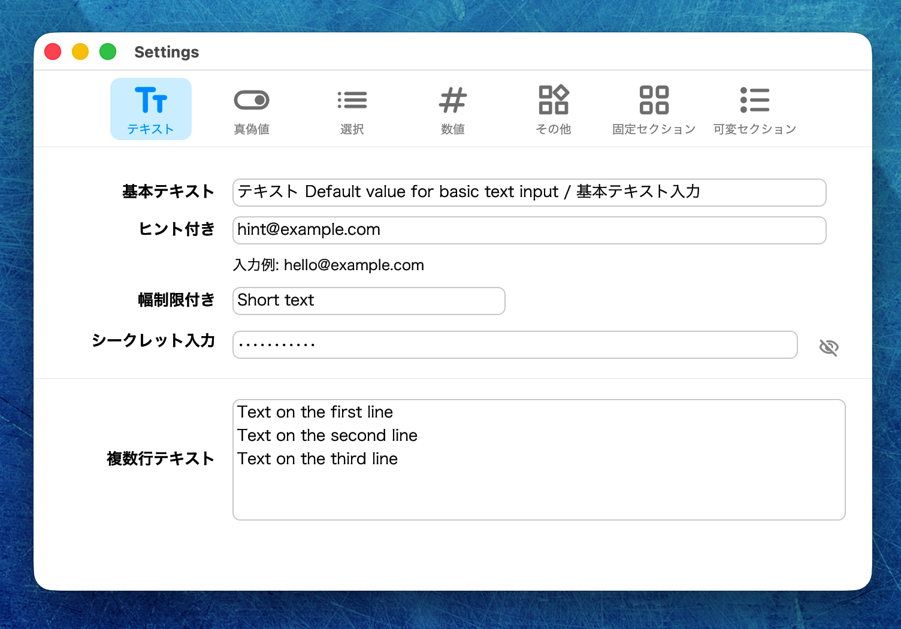
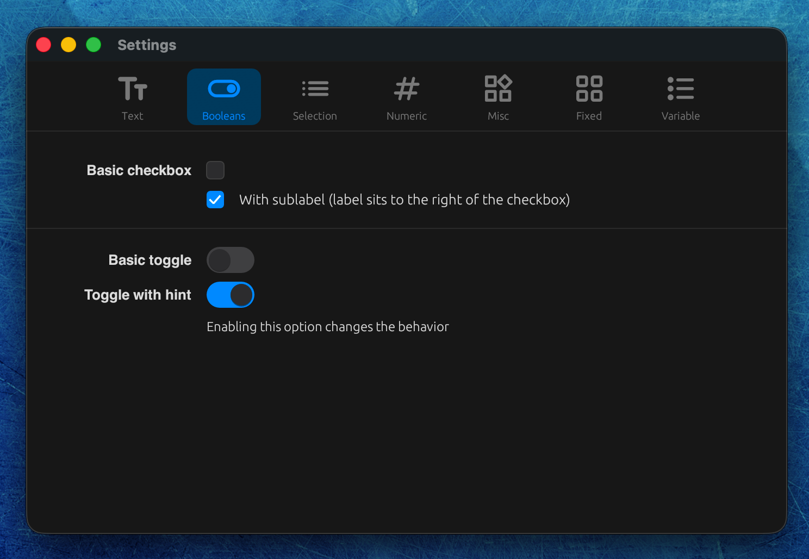
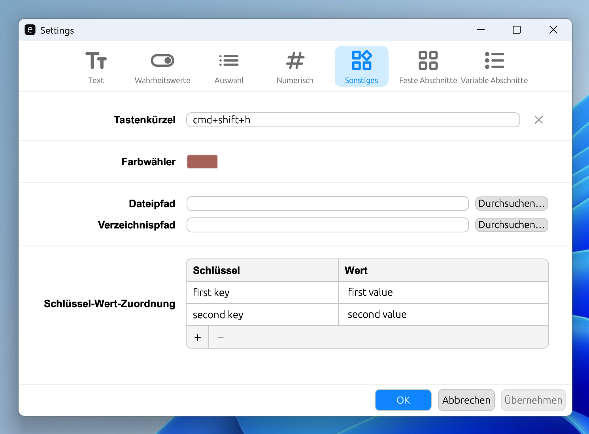
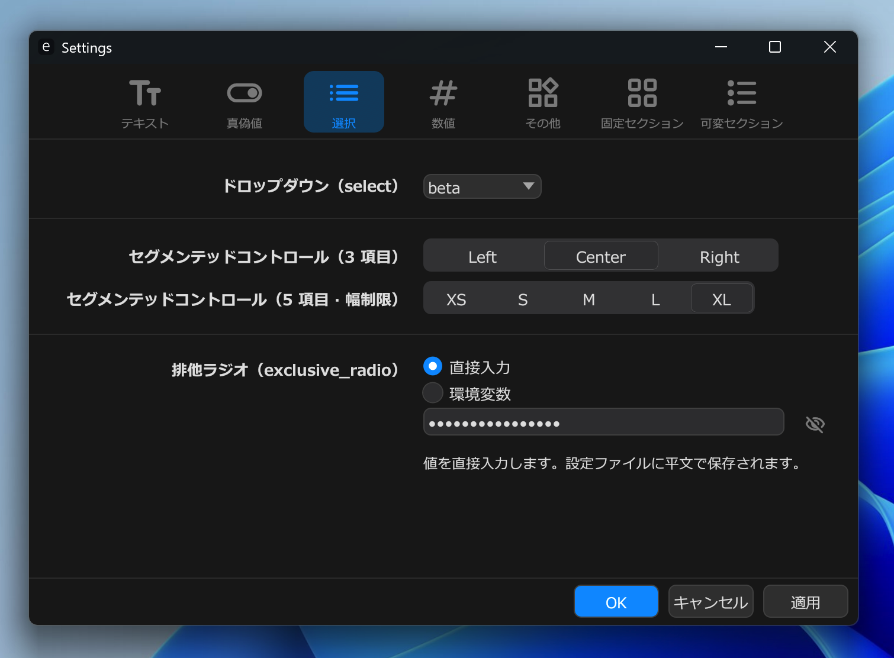
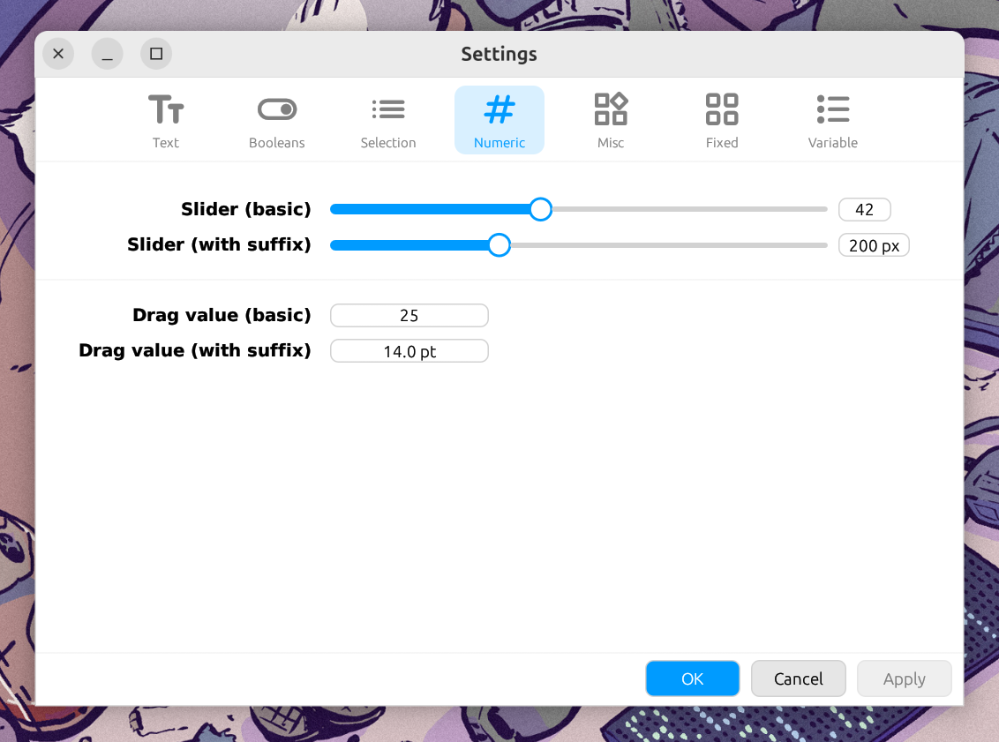
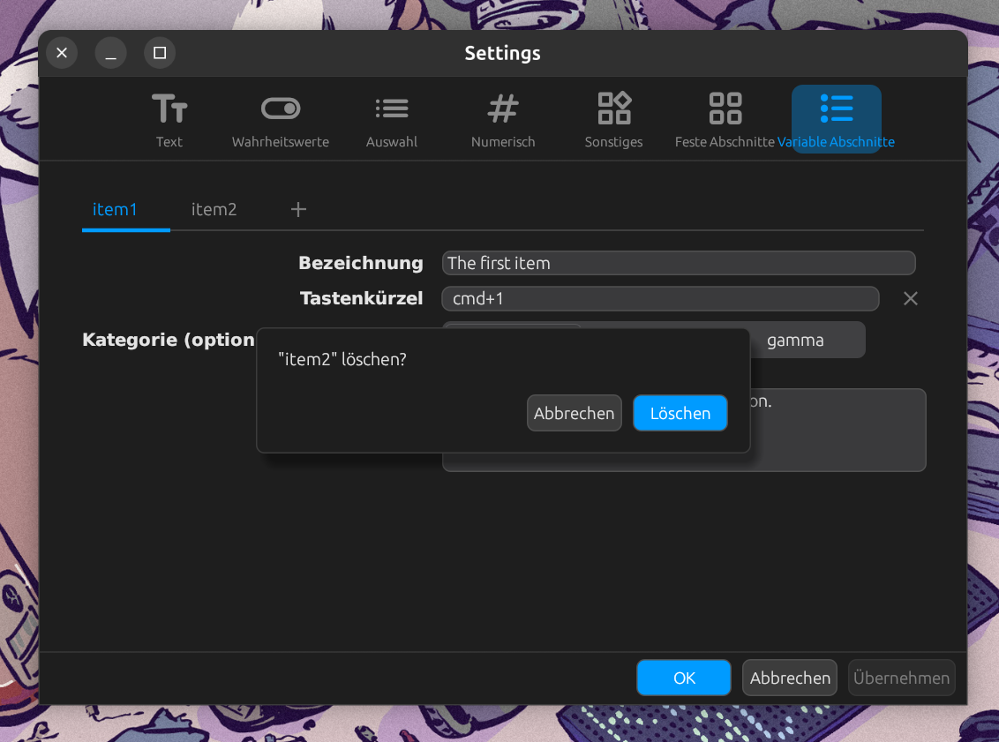

# Settings

TOML 形式の設定ファイルを持つアプリケーション向けの，独立した設定ウィンドウ。
別プロセスのバイナリとして動作し，TOML の読み書きのみを担うため，親アプリのライフサイクルに依存しません。

|             | Light                                                          | Dark                                                       |
| ----------- | -------------------------------------------------------------- | ---------------------------------------------------------- |
| **macOS**   |          |          |
| **Windows** |  |  |
| **Linux**   |          |    |

**English:** [README.md](README.md)

---

## 機能

- **スキーマ駆動** — TOML ファイルで設定を記述するだけ。コード不要
- **16 言語組み込み** — アラビア語・中国語（普通話）・ドイツ語・英語・フランス語・ヒンディー語・イタリア語・日本語・韓国語・オランダ語・ポルトガル語・ロシア語・スペイン語・スウェーデン語・トルコ語・ベトナム語
- **Light / Dark テーマ** — OS 追従または固定。カラーパレットを完全カスタマイズ可能
- **外部変更検知** — 設定ファイルを監視し，競合時にダイアログを表示
- **クロスプラットフォーム** — macOS・Windows・Linux

## クイックスタート

**1. `schema.toml` を作成する:**

```toml
icon_style = "rounded"
theme      = "os"
lang       = "os"

[[tabs]]
id    = "general"
label = { en = "General", ja = "一般" }
icon  = "settings"

[[tabs.fields]]
key    = "server.host"
label  = { en = "Host", ja = "ホスト" }
type   = "string"
widget = "text_input"

[[tabs.fields]]
key    = "server.port"
label  = { en = "Port", ja = "ポート" }
type   = "number"
widget = "drag_value"
min    = 1
max    = 65535
```

**2. ビルド:**

```bash
cd settings
SETTINGS_SCHEMA=/path/to/your/schema.toml make
```

**3. 親アプリから起動:**

```rust
std::process::Command::new("path/to/settings").spawn()?;
```

## 親アプリへの組み込み

### macOS `.app` バンドル

```
MyApp.app/Contents/MacOS/
├── MyApp
└── settings
```

```rust
let settings = std::env::current_exe()?
    .parent().unwrap()
    .join("settings");
std::process::Command::new(settings).spawn()?;
```

### Windows

`Settings.exe` を親アプリの実行ファイルと同じディレクトリに置き，インストーラーで両方を配置します。

### Cargo workspace（Git submodule）

```toml
# 親アプリの Cargo.toml
[workspace]
members = ["myapp", "settings"]
```

スキーマはビルド時に `SETTINGS_SCHEMA` 環境変数で指定します。`make` のデフォルトは `../schema.toml`（クレートルートの一階層上，親アプリのスキーマ）です。`SETTINGS_SCHEMA` を設定せず `cargo build` を直接実行した場合は `demo/schema.toml` にフォールバックします。

## ビルド

| 場面                                 | 使用されるスキーマ                                          |
| ------------------------------------ | ----------------------------------------------------------- |
| `make`（上書きなし）                 | `../schema.toml` — クレートルートの一階層上，親アプリのスキーマ |
| `make SCHEMA=/path/to/schema.toml`   | 指定パス                                                    |
| `SETTINGS_SCHEMA` なしの `cargo build` | `demo/schema.toml` — スタンドアロン開発用フォールバック     |

```bash
cd settings

# 初回 / アイコンスタイル変更時
make icons                          # Material Symbols をダウンロード（rounded）
make icons ICON_STYLE=outlined      # バリアント: rounded / outlined / sharp

# 親アプリ同梱用バイナリ（現在のアーキテクチャ）
make binary
make SCHEMA=/path/to/schema.toml binary

# スキーマ検証のみ（GUI はビルドしない）
make check-schema

# スタンドアロン配布物（本番スキーマ）
make settings-arm64                 # macOS .app → dist/settings/darwin-arm64/
make settings-win                   # Windows .exe → dist/settings/windows-x86_64/
make settings-linux                 # Linux バイナリ → dist/settings/linux-x86_64/

# スキーマ検証 CLI（スキーマは埋め込まない）
make settings-schema-checker-arm64  # → dist/settings-schema-checker/darwin-arm64/

# デモ GUI（demo/schema.toml）— demo/Makefile を参照
cd demo && make demo-arm64

make clean
```

出力先：

| パス | 説明 |
| ---- | ---- |
| `target/release/settings` | 親 macOS / Linux アプリに同梱する生バイナリ |
| `dist/settings/<arch>/` | 本番スキーマのスタンドアロン GUI（`darwin-arm64`, `windows-x86_64` 等） |
| `dist/settings-schema-checker/<arch>/` | スキーマ作者向け `settings-schema-checker` CLI |
| `demo/dist/<arch>/` | `config.toml` 同梱のデモ GUI |

ARCH slug: `darwin-arm64`, `darwin-x86_64`, `windows-x86_64`, `linux-x86_64`。

## ドキュメント

スキーマリファレンス・ウィジェットガイド・テーマ・ローカライズの詳細:

**https://emotiongraphics.jp/docs/ja/ref/settings/**

### `segmented_control` と `type`

`segmented_control` は既定で文字列（`type` 省略または `type = "string"`）を読み書きします。
`type = "number"` にすると TOML の数値として保存します。`options` はセグメントのラベル兼
保存値となる数値の文字列表現です。すべての option に `.` が含まれない場合は整数リテラル
（例: `count = 3`）、いずれかに `.` がある場合は浮動小数点リテラル（例: `weight = 2.0`）
として書き込みます。

## ライセンス

MIT License
